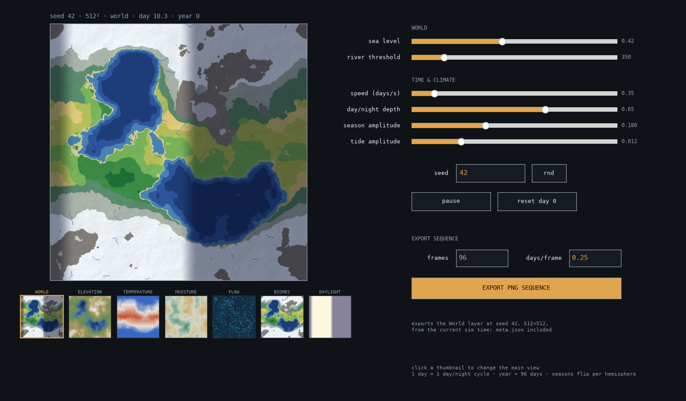

# World Engine — prototype (M0–M4)

The world is a pure function: `world(seed, x, y, t) → layers`. See `DESIGN.md`
for the full design. This repo is the Python prototype stage of the roadmap:

- `worldgen.py` — the world's **field producers** (data, not pixels): windowed
  tileable noise → elevation & moisture, and D8 flow → rivers. Pure numbers.
- `world_core.py` — the shared core. `state(ws, t, …)` computes the world's
  **per-tile data once** (elevation, temperature, biome ids, vegetation, water,
  ecosystem health, plus the Godot-facing render payload: carved height,
  terrain normal, center sun vector, cloud cover, terrain shadow, cloud shadow,
  and final sunlight …); `colorize(state, layer)` is a thin RGB skin over it, and
  `render()` wraps the two. Also holds the M2 time layer, the M3 history CA, and
  the M4 `EcoSim`. numpy in, data/pixels out; no UI, no I/O. `state()` is the
  seam a Godot `TileMapLayer` reads directly.
- `world_viewer.py` — **the desktop layer console** (matplotlib) around the
  core: every layer animating, sliders, PNG-sequence exporter.
- `web/` — **the same console in the browser** (works on a phone):
  `worldgen.py` + `world_core.py` run unmodified in the browser through
  Pyodide (Python on WebAssembly); the page is only canvas + sliders + a
  zip download. Deployed to GitHub Pages by `.github/workflows/pages.yml`,
  which also vendors the Pyodide runtime so there is no CDN dependency.

**Live console:** https://alivemachine.github.io/fabletest/
(first visit downloads the Python runtime, ~12 MB, cached afterwards)



## Run

```bash
pip install -r requirements.txt
python3 world_viewer.py                 # default: seed 42, 256² (fluid)
python3 world_viewer.py --seed 7 --size 512   # prettier, heavier rebuilds
```

## Godot prototype

A Godot 4 prototype client now lives in `godot_client/`. It keeps simulation in
Python and streams a player-centered chunk through `godot_bridge.py`.

```bash
python godot_bridge.py --seed 42 --size 192 --civ-count 3
```

Open `godot_client/` in Godot 4.2+ and run the main scene. The current client
is a 3D chunk renderer with sprite-stacked props and parallax layers. If you
later switch to an authored `TileMapLayer` terrain surface, `better-terrain`
would be a good fit there; see `godot_client/README.md`.

## The interface

- **Big map + 7 thumbnails** (world composite, elevation, temperature,
  moisture, flow, biomes, daylight) — all animating. **Click a thumbnail**
  to promote that layer to the main view.
- **Pan & zoom the big map** — scroll / pinch to zoom, drag to pan,
  double-click to zoom in or reset. This is not an image zoom: the world is a
  pure function of *continuous* `(x, y)`, so diving in re-samples the same field
  at a finer step and **adds** higher-frequency detail, coherent with the planet
  above it — the coastline you saw from orbit is exactly where you left it, you
  just see the individual bays now. Thumbnails stay whole-planet so you keep
  your bearings, and **export captures the current window**, so a zoomed patch
  exports as easily as the whole globe.
- **World**: seed textbox + `rnd` button, sea level, river threshold. The
  **tide** is a waterline that *sweeps a fixed beach* (the sand is as wide as
  the tidal range and stays put; only the water covering it moves); the
  **sea-level slider** still moves the whole coast — and, with the clock running,
  floods or exposes land with lasting consequences visible in the flora/fauna/civ
  layers.
- **Time & climate**: **logarithmic** sim speed (crawl to thousands of days/sec
  — fast-forward centuries), day/night depth, season amplitude (opposite per
  hemisphere; crank it for hot summers that spark fires/drought), tide amplitude.
- **Transport**: pause / run, **reset to day 0** (also rewinds the living
  ecosystem to pristine).
- **Export**: writes `exports/world_s<seed>_<layer>_<N>f/frame_0000.png …`
  of the *current view layer* at the current seed and settings, starting at
  the current sim time, plus a `meta.json` recording every parameter — so any
  sequence is exactly reproducible.

Time model: 1 sim day = one day/night cycle, year = 96 days, tide ≈ 12.5 h.

## The layers

| Layer | What it is | Tool (per DESIGN.md) |
|---|---|---|
| Elevation / Temperature / Moisture | static fields; temp carries seasons | noise + gradient |
| Clouds | two noise sheets advected by wind, gated by moisture, piled on windward slopes | advected noise |
| Flow | D8 flow accumulation → rivers | flow algorithm |
| Biomes | lookup on (elevation, temperature, moisture) | table |
| Flora | **living** vegetation = climatic baseline × ecosystem health, with burn/salt scars | field ⊕ M4 Δ |
| Fauna | **living** herbivore/predator biomass (Lotka–Volterra) × ecosystem health — the game map | population CA ⊕ M4 Δ |
| Civilization | 1–6 factions from the M3 history, **dimmed where the ecosystem has collapsed** and charred where scorched | history CA ⊕ M4 Δ |
| History | the chronicle: same territory with conflict fronts (red) and shortage/blight zones (violet) drawn on | history CA (M3) |
| Light | sun-driven lighting from the current heightfield, with terrain normals and projected terrain/cloud shadows | heightfield + cloud projection |

### M3 — the history simulation

Civilization is no longer a closed-form curve; it is a coarse cellular
automaton (`HIST_SIZE`² grid, one step per sim-week) that actually runs:

- **stocks per cell** — population, food capacity, faction influence, unrest.
- **dynamics** — population grows logistically toward food capacity and
  colonises reachable land; faction *influence* diffuses outward (blocked by
  sea and mountains) and whoever has the most influence owns the cell.
- **border conflict is emergent** — where two factions' influence meet and
  contest a border, that contest is an attrition term: population declines along
  the front and ownership flips when one side overtakes. Nothing is scripted.
- **shocks feed the food chain** — deterministic **pests/blights**,
  **droughts** (arid, long), and **cold spells / ice** (polar, long) each
  depress food capacity in a region for a while. Capacity drops below
  population → food shortage (the logistic term goes negative) → unrest →
  border conflict and migration. That is the blight → shortage → conflict →
  migration cascade, run through the food web rather than authored.

The CA is **integrated once at build time** into ~110 keyframes over a
24-year horizon, stored compactly (uint8). `render(t)` interpolates the
timeline, so history stays fully **seekable and exportable** — scrub to any
year, export any year — even though the underlying process is stateful. Past
the horizon the final state holds. The **Civilization** layer shows territory
and population; the **History** layer overlays the conflict fronts and shortages.

### Far form vs near form (why these are seekable)

Every time-dependent layer here is the **far form** — a pure, *seekable*
function of `t` (a stock/statistic). You can jump to day 500 without
simulating days 0–499, which is exactly what the exporter relies on. Fauna
rides the Lotka–Volterra *limit cycle* directly instead of integrating the
ODE; civilization applies logistic growth in closed form. Cross-layer
coupling that can be written as an algebraic function of the current fields
is included (moisture→flora→fauna carrying capacity; flora+water+climate→
civilization habitability; civilization→local game depletion).

The **near form** — live agents that integrate over time, where a blight, a
border conflict, a storm, or an advancing ice front is a *shock injected into a
stock and propagated through the food-web graph* — is the M4 Resolver. It is stateful
(not seekable) by nature, so it is deliberately a separate build, not part of
this pure-function core.

### The living ecosystem (M4 `EcoSim`, folded into flora/fauna/civ)

Most layers are pure functions of `t`; the **ecosystem is not.** A coarse sim
(`EcoSim`) *integrates forward as the clock runs and has memory*, tracking **soil
fertility, vegetation, fauna, civilisation, and burn/salt scars** per cell. It is
not a separate layer — it is the stateful **Δ** that the flora, fauna and
civilisation channels carry: each is drawn as `baseline × ecosystem-health`, so
an undisturbed world matches the pure fields exactly and a wrecked one shows its
scars. One flora, and it is the living one.

- **Your sliders are the triggers.** Shoving the **sea-level** slider up floods
  land relative to the level the ecosystem is *adapted* to (its `sea_ref`,
  which drifts only slowly) → a biomass crash and **salinated soil**; pull it
  back and the exposed seabed is barren, greening only from the edges. High
  **season amplitude** drives hot summers that **ignite fires** in grass/savanna
  and **desertify** bare hot ground.
- **Slow variables give irreversibility.** Fertility and scars heal on a
  timescale of *years*, and vegetation/fauna/civilisation only recover by
  **colonisation from neighbouring cells** — so a cleared, isolated region stays
  barren until life spreads back in. Some worlds never recover; that is the
  point — you can watch which worlds last.
- **Consequences ⇒ not scrubbable backward.** The state at day 900 depends on
  the whole path of what you did, not on a formula of `t`, and the dynamics are
  dissipative (a burned and a submerged forest both end at `veg=0` — the present
  can't tell you which). So the ecosystem only runs **forward or resets**; the
  seekable channels underneath stay pure. The stateful part is one `EcoSim`.
- **Fast-forward centuries.** The speed control is logarithmic (up to thousands
  of days/sec, with internal sub-stepping) so you can wreck a world and watch,
  over simulated centuries, whether it ever greens again — in the flora, fauna
  and civilisation layers directly.

This is the far→near step of the design made real: the pure baselines are the
seekable substrate; the ecosystem `Δ` is the stateful stock field every future
M4 agent (herds as boids, settlements, NPCs) will expand out of and collapse
back into.

### Continuous zoom — the pure function at any scale (the step before M4)

The 512² grid was never "the world" — it is one *sampling* of `world(seed, x,
y, t)`, which is defined for continuous `x, y`. So a "world map" and a "tile-
accurate patch of one beach" are the same function sampled over different
windows, not two different data structures:

- **Windowed noise** (`worldgen.noise_window`) samples any window
  `[cx±span/2, cy±span/2]` of the unit torus at any zoom. Its value at each
  integer lattice corner is a *hash* of `(seed, octave, i, j)`, so we only ever
  evaluate the corners a window touches — O(window pixels), independent of zoom
  depth. A million-cell-wide high-frequency octave is never allocated; it is
  sampled four corners at a time.
- **Detail is added, not revealed.** Each octave is divided by a *fixed* total
  (Σ½ⁿ = 2), never by "how many octaves we summed," so the low octaves
  contribute identically at every zoom. The planet's coastline stays put; diving
  in only *adds* the finer octaves that a wider window couldn't resolve. This is
  why zoom is coherent rather than a blur.
- **`WorldSlice.view(cx, cy, zoom)`** re-samples the fields for a window and
  reuses this planet's history timeline, faction cores and normalization by
  reference — so panning and zooming never re-runs the M3 CA. Latitude,
  longitude and hillshade are recomputed from the window's *world* coordinates,
  and the coarse history grid is sub-sampled to the window, so temperature,
  seasons, day/night and territory all stay correct as you dive in.

A planet is *supposed* to be finite (it wraps — it is a globe); what you
actually wanted was infinite **detail**, not infinite **extent**, and that is
what zoom gives: finite world, bottomless zoom, computed only for the window on
screen.

**Rivers under zoom** work by splitting path from magnitude: the *path* comes
from local D8 on the window's refined elevation (the fine valley network — the
shared low octaves put it in the same valley the planet river runs), and the
*magnitude* comes from the planet's accumulation sampled per pixel (the true
upstream volume). Channels get **physical width** (∝ √discharge, hydraulic
geometry), so a big river reads as a line from orbit and resolves to many
pixels wide as you dive in. The viewport **pixel-snaps** to the drainage
lattice, so panning translates the exact same samples — no shimmer — and drag
frames that snap to the same cell reuse the cached window.

**Settlements under zoom (the first M4 `expand()`):** below `SETTLE_SPAN` the
civ summary resolves into settlements. Candidate sites live on a hashed
lattice (16 per HIST cell); a site founds when its cell's population clears a
hash-staggered threshold (villages light up one by one as a region fills, and
vanish if it empties), and each renders by a deterministic grammar keyed by
`(seed, cell)` — 2–4 street lanes, two building rows per lane, faction-tinted,
dimmed by stress, never in water or on a river. Faction cores are guaranteed
capital towns, snapped to solid land at founding. Nothing is stored (same
village every visit, like the rivers), and a budget governor expands the most
populous sites first. **Still open:** roads between settlements, interiors
(WFC), and near-form herds/NPCs — the rest of the M4 Resolver.

## Turning a sequence into a video

```bash
ffmpeg -framerate 24 -i exports/world_s42_composite_96f/frame_%04d.png -pix_fmt yuv420p world.mp4
```

## Notes

- Everything time-dependent is recomputed per frame, vectorized in numpy;
  only elevation/moisture/flow are rebuilt (once) when seed or size changes.
- `compute_rivers` in the original M0 file had a D8 sign bug (`np.roll`
  sampled the neighbor at `−offset` but recorded the index at `+offset`),
  which silently broke flow accumulation — max accumulation was ~14, so no
  river ever crossed the threshold. Fixed here; rivers now accumulate
  properly and the flow layer shows the drainage network.
- The default river threshold scales with resolution (`350` is tuned for
  512²).
